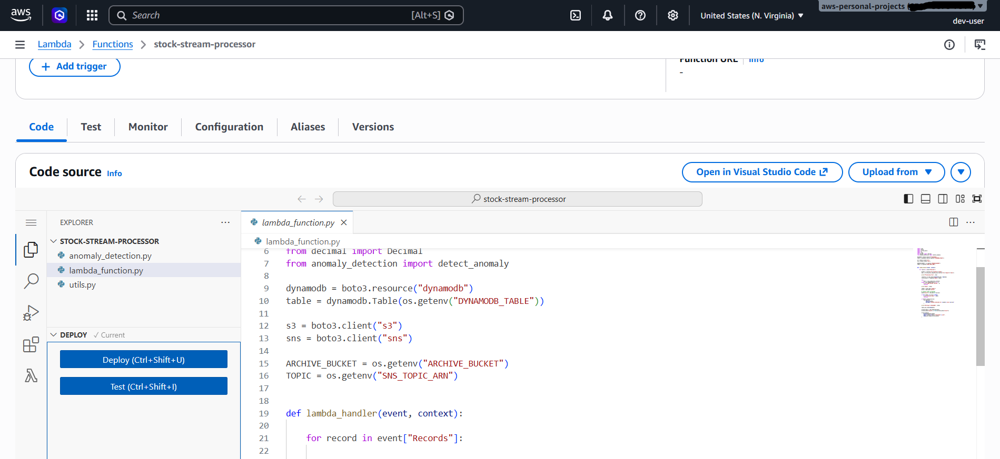
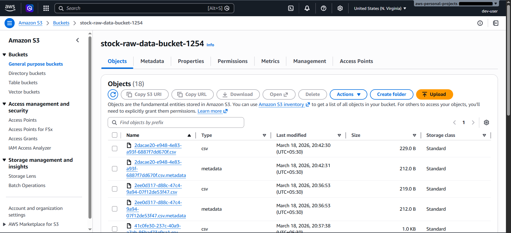
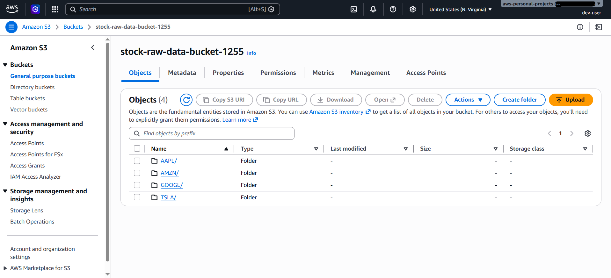
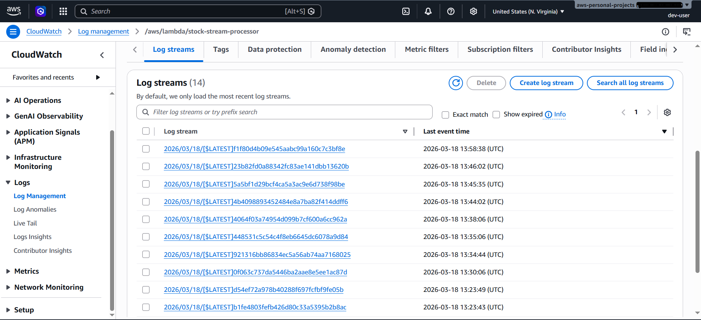
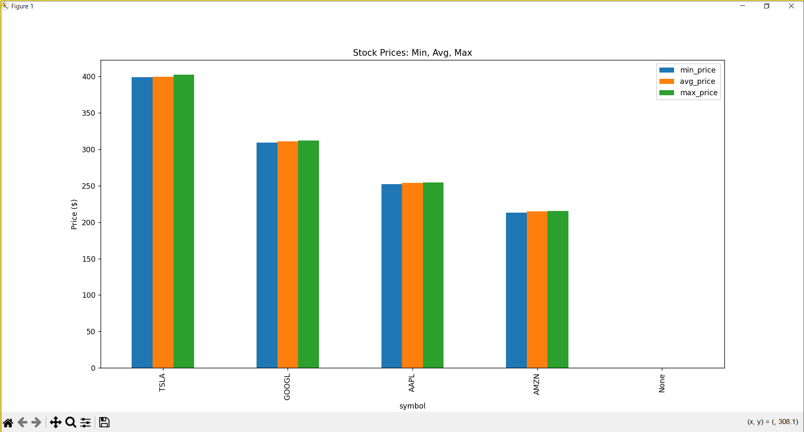

Real-Time Stock Market Data Analytics Pipeline (AWS Serverless)
Overview

This project demonstrates a real-time stock market data analytics pipeline built using AWS serverless services. The system ingests live stock data from external APIs, processes and analyzes it in real time, detects anomalies, and provides insights through queries and visualizations.

The architecture follows an event-driven, scalable, and cloud-native design, making it suitable for real-world data engineering workflows.

Architecture

🔵 How It Works
✔  Data Ingestion

A Python-based producer fetches real-time stock data from:

Finnhub API

AlphaVantage API

Data is stored as JSON files in an Amazon S3 incoming bucket.

✔  Event-Driven Processing

AWS Lambda is triggered automatically on S3 object creation (PUT event).

The Lambda function:

Validates incoming JSON data

Detects anomalies in stock prices

Converts float values to Decimal (for DynamoDB compatibility)

Stores processed data in DynamoDB

Archives raw data in another S3 bucket

✔  Storage

Amazon DynamoDB → Stores processed stock data for real-time access

Amazon S3 (Archive Bucket) → Stores raw JSON for historical analysis

✔  Alerts

Amazon SNS sends real-time alerts when anomalies are detected.

✔  Analytics

Amazon Athena runs SQL queries directly on S3 data

Example query:

SELECT symbol, AVG(price) AS avg_price
FROM stock_data
GROUP BY symbol;

✔  Visualization

Python (PyAthena + Pandas + Matplotlib) is used to generate charts and insights.

✔  CI/CD Pipeline

Implemented using GitHub Actions

Automatically:

Packages Lambda code

Deploys updates to AWS Lambda

Enables continuous deployment for serverless functions

▶ Tech Stack

Languages: Python

AWS Services:

Amazon S3

AWS Lambda

Amazon DynamoDB

Amazon SNS

Amazon Athena

Amazon CloudWatch

Libraries: boto3, Pandas, Matplotlib, PyAthena

CI/CD: GitHub Actions

APIs: Finnhub, AlphaVantage

✅ Features

🟢 Real-time stock data ingestion from external APIs

🟢 Event-driven processing using AWS Lambda

🟢 Anomaly detection on stock prices

🟢 Dual storage strategy (DynamoDB + S3 Data Lake)

🟢 Real-time alerts via SNS

🟢 SQL-based analytics using Athena

🟢 Data visualization with Python

🟢 Automated CI/CD pipeline for Lambda deployment

🟢 Monitoring using CloudWatch logs

📸 Screenshots

🟢 Key Learnings

Designing event-driven serverless architectures

Handling data type constraints (Decimal vs float) in DynamoDB

Implementing real-time pipelines without managed streaming services

Using Athena for serverless analytics on S3 data

Building CI/CD pipelines for AWS Lambda

📎 License
This project is for educational and portfolio purposes.